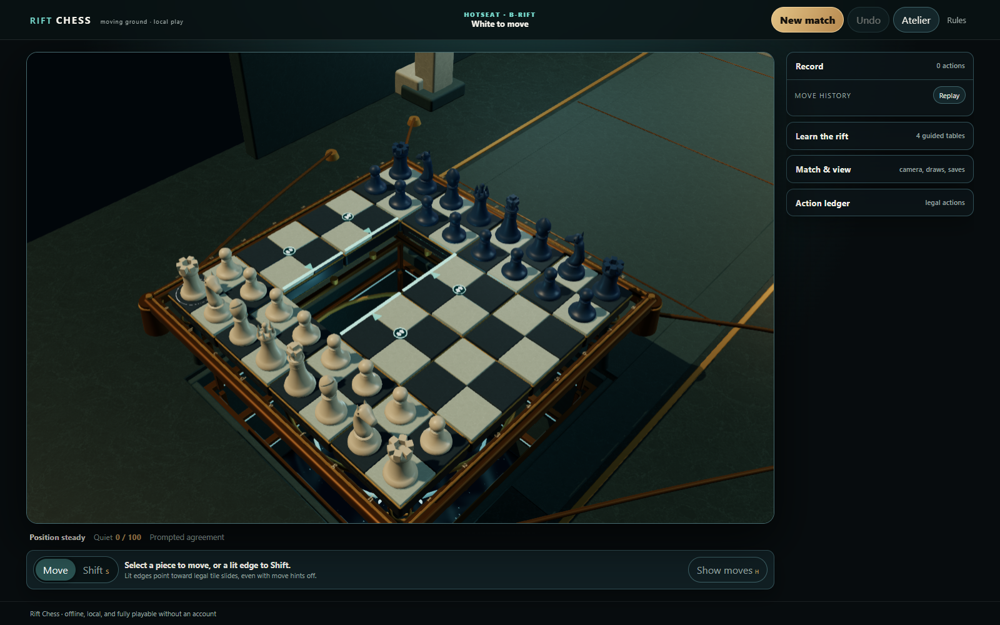

# Rift Chess

> **Move the piece — or move the ground beneath it.**

[](https://haileystorm.github.io/rift-chess/)

Rift Chess is an offline 3D chess variant played on fourteen sliding 2×2 tiles. On each turn, make an ordinary chess move or Shift a tile into a neighboring hole. A tile may be empty or carry one friendly non-king passenger; holes cut sliding attack lines, and king safety still decides what is legal.

**[Play in your browser](https://haileystorm.github.io/rift-chess/)** · **[Windows download](https://github.com/HaileyStorm/rift-chess/releases/download/v1.1.0/Rift-Chess-win32-x64-1.1.0.zip)** · **[v1.1.0 release notes](https://github.com/HaileyStorm/rift-chess/releases/tag/v1.1.0)** · **[Source](https://github.com/HaileyStorm/rift-chess)**

Version 1.1 rebuilds the table, pieces, environments and controls. The opening slides into place from a shuffled arrangement, and lit tile edges show where the ground can move. Explore Gallery, Nocturne and Daylight with Classic or Faceted sculpture in ceramic, metal or wood.

## Play

The browser edition needs an online first visit so its service worker can cache the bundled game. Later visits can play offline from the same browser and origin. The game, local saves, and local bot have no account, server, model download, or gameplay network dependency.

For Windows 11 x64, download `Rift-Chess-win32-x64-1.1.0.zip`, extract the **entire** folder, then run `Rift Chess.exe`. Do not move the executable out of its folder: it needs the included Electron runtime files. This is an unsigned Electron 44.2 package; Windows may show its usual unsigned-app warning. Node.js is only needed for development, never to play the browser or packaged game.

Windows 11 x64 is the only tested desktop platform. The app was not tested on Linux or macOS.

### Controls

Click a piece and then its destination for an ordinary move. For a Shift, select a lit tile edge or choose **Shift mode**, select the tile, then click its legal destination hole. Hover or keyboard focus previews the destination. Selecting the same source cancels; another legal source reselects it. Promotion asks for a piece before the action commits. Legal Shift indicators remain visible even when ordinary move hints are hidden.

With the board focused, use arrow keys to move focus and **Enter** to select. **S** selects Shift mode, hold **H** to reveal ordinary legal moves, **Escape** clears a selection, **1–4** choose White/Black/Overview/Top cameras, and **Home** resets to White view. Right-drag rotates the camera, the wheel zooms, and two-finger touch orbits/zooms. Camera gestures do not commit moves.

Choose local hotseat or play either color against the shipped local search bot. The bot runs in a worker and has no claimed Elo or human-strength rating. Matches support B-rift/C-rift openings, save/import/export/replay, practice undo, draw offers, threefold repetition, and the selected quiet-action policy.

## Rules, design, and evidence

- [Rules 1.0](docs/01_RULES.md) and the [play guide](docs/02_PLAY_GUIDE.md)
- [Original decision narrative](docs/05_DECISION_NARRATIVE.md) — including rejected ideas, prior work, and evidence limits
- [Analysis report](report/RIFT_CHESS_ANALYSIS.html) ([PDF](report/RIFT_CHESS_ANALYSIS.pdf), [Markdown](report/RIFT_CHESS_ANALYSIS.md))
- [Implementation record](docs/IMPLEMENTATION.md), [local API](docs/API.md), and [playtest record](docs/PLAYTESTS.md)
- [1.1 overhaul report](docs/OVERHAUL_RELEASE.md) and [current acceptance evidence](docs/evidence/overhaul/acceptance.json)

The implementation has fixture/API conformance checks, real canvas-driven mechanics and lifecycle tests, visual inspection captures, complete-game coverage against the actual local worker, browser offline-restart checks, and an offline packaged-Windows check. These are automated and visual checks, not a human usability study, a balance result, a universal performance guarantee, or a bot-strength rating. See [PLAYTESTS.md](docs/PLAYTESTS.md) for the exact evidence and limitations.

Occasional frame spikes remain on the tested Iris Xe host. Those limits were accepted for this release and remain documented in the [performance evidence](docs/evidence/overhaul/performance.json) and [open profiling follow-up](https://github.com/HaileyStorm/rift-chess/issues/1).

The supplied original handoff, research, and Python reference remain preserved at [provenance/Rift_Chess_Final_Package.zip](provenance/Rift_Chess_Final_Package.zip). Its historical records are provenance, not a claim that later application files were part of that package.

## Develop

Requires a current Node.js development environment.

```powershell
npm ci
npm run dev       # local Vite development server
npm run build     # type-check, build, and prepare the static offline cache
npm test          # Vitest suite
npm run desktop   # build, then launch Electron locally
npm run package   # create the Windows x64 ZIP
```

The pure engine powers the browser, Electron, the local worker, and the newline-delimited JSON headless API. See [API.md](docs/API.md) for the checked command boundary and record formats.

## Credits and license

Rift Chess is an independent project inspired by [xkcd #3139, “Chess Variant”](https://xkcd.com/3139/). The comic is **not bundled, traced, embedded, or relicensed**. Original source and procedural art are MIT-licensed; see [LICENSE](LICENSE), [the asset ledger](docs/ASSET_LEDGER.md), and [third-party notices](THIRD_PARTY_NOTICES.md).

GPT-6 Astra assisted implementation and review. That factual development role does not imply an OpenAI endorsement, a model benchmark result, or human-play evidence.

The versioned API could support a future peer-to-peer or relay transport, but online multiplayer is not implemented in v1.1.0. Such a feature would still need signaling, seat identity, reconnection handling, and possibly TURN; no serverless-connectivity promise is made.

## Support

Rift Chess is free. Optional contributions support development and maintenance and never change access to gameplay, features, or the local opponent: [Buy Me a Coffee](https://buymeacoffee.com/threadspan). See [DONATIONS.md](docs/DONATIONS.md) for the approved contribution details.
