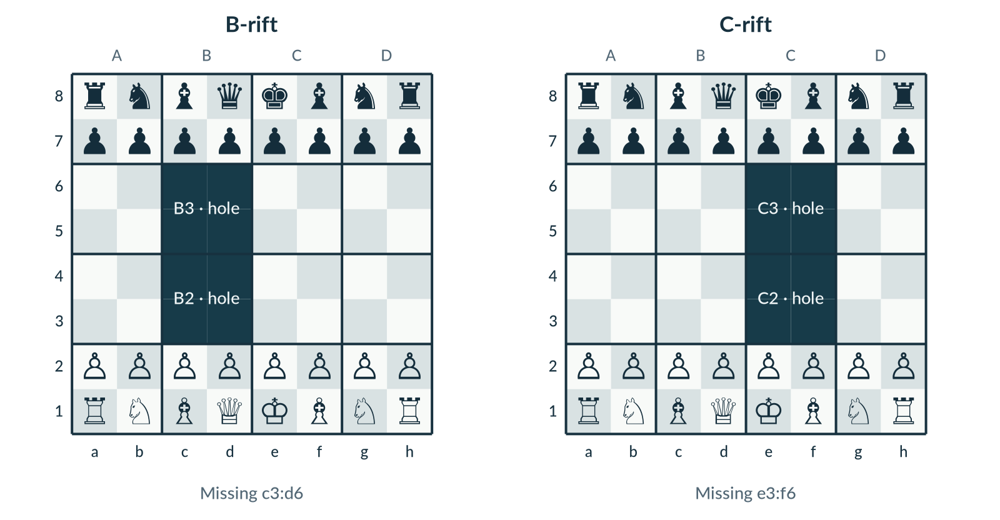
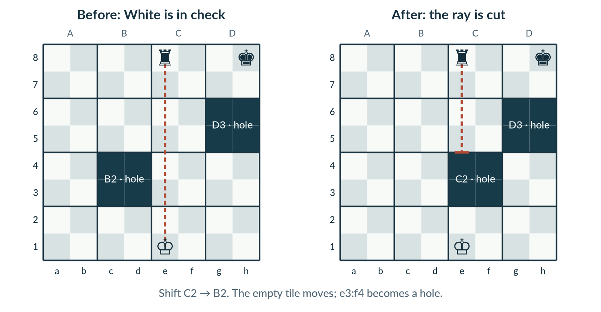
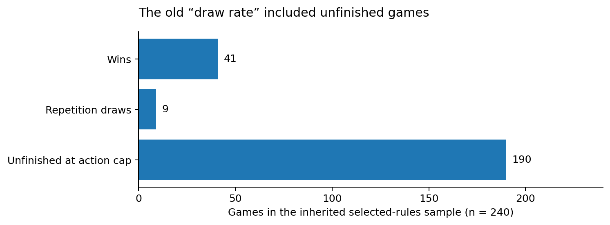
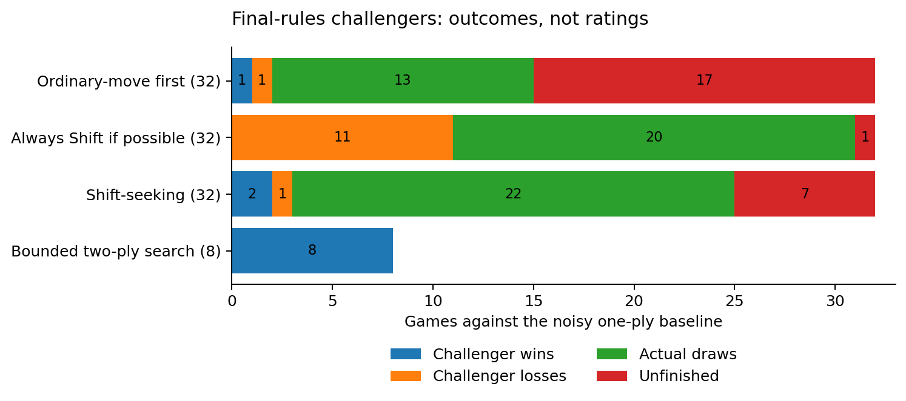
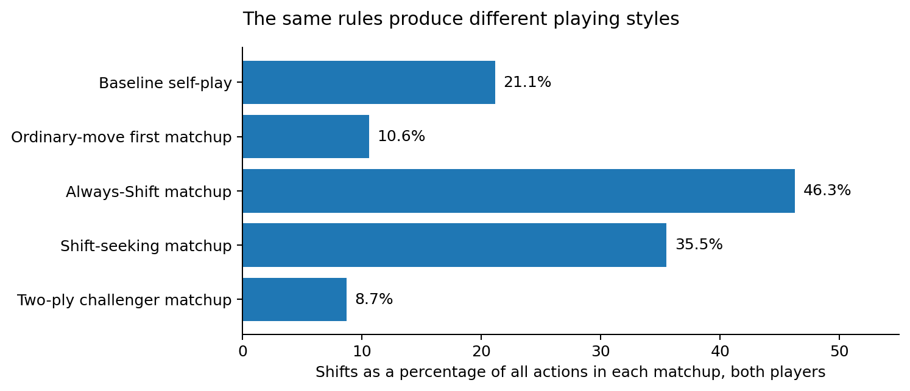

# Rift Chess: the decision and the evidence

**Selected rules 1.0 · Design handoff · 6 September 2026**

A small offline game with a large visual ambition: chess on fourteen moving 2×2 platforms. The rules are ready to implement. The 3D client, human usability and long-term balance are not yet tested.

## 1. The chosen game

**Fourteen tiles. Two holes. One action per turn.** Move a chess piece or Shift one orthogonally adjacent tile into a hole. A Shiftable tile is empty or holds exactly one friendly non-king. Both kings anchor their current tiles.

B-rift removes c3:d6; C-rift removes e3:f6. Each opening has **15 ordinary moves and four Shifts**. Both preserve rank-reflection/color-exchange geometry. That is structural symmetry, not a proof that moving first has no advantage. Play the same layout with colors exchanged; use four games to cover both layouts fairly.

**Why this combination:** empty-tile Shifts keep the terrain mechanic available; one passenger limits multi-piece tempo; fixed king tiles keep king safety readable; central gaps make the premise relevant without removing starting pieces.

## 2. What makes a Shift interesting

A Shift both relocates a passenger and changes which four squares exist. It never captures. Rook/bishop/queen rays stop at holes; knights may jump intervening gaps but must land on present squares.

The completed position decides king safety. Animation frames do not become temporary chess positions. A king-exposing Shift is rejected even when its source tile is empty.

The rest stays tightly specified: transport consumes pawn/rook movement rights; only orthodox castling; a Shift never creates en passant; every reply expires the previous opportunity; Shift promotion offers Q/R/B/N immediately. A backward ride to a pawn's own back rank remains legal without promotion.

## 3. The old results needed an audit

The supplied CSVs describe **4,560 screening runs**, but only aggregate tables were supplied. They are inherited summary-only evidence, not newly reproduced raw matches. The unrestricted candidate changed several rules at once, and two named layout rows share one geometry.

The selected one-passenger row used Shifts for **23.1% of actions**. About **85.5% of those Shifts were empty**—terrain manipulation did more work than passenger transport for those weak agents. Neither number is an optimal design target.

The old apparent 82.9% draw rate counted the 190 capped games as draws. The corrected reading is 41 wins, nine genuine draws and 190 unfinished games. Old first-Shift indices also began at zero; the selected row's average becomes about action **14.8**, not 13.8, when reported to a player.

## 4. Fresh final-rules tests

**120 new games · 14,290 replay-verified actions · no invented draw results.** Every match used the final rules with Prompted agreement. The bots did not offer or accept draws. Shallow games were capped at 180 actions; the eight bounded two-ply challenger games were capped at 100. Caps are reported as unfinished.

**Always Shift is exploitable by this baseline.** In its 32 games, the forced-Shift challenger won none and lost eleven; twenty were repetition draws. This supports making Shifts a choice rather than an extra free action. It does not prove optimal play or rule balance.

**Ordinary-first was not shown to be losing.** Its 1–1 result with many unfinished games leaves the value of strong terrain play unresolved. The Shift-seeking result is likewise inconclusive.

**The small search opponent is useful, not rated.** A bounded search targeting two plies won eight of eight tests against the weak one-ply baseline. That supports a local beginner opponent; it says little about human or strong-engine play.

The separate baseline self-play group had 16 games: two wins, eleven real draws and three unfinished. Shifts accounted for 21.1% of its actions. Do not compare its draw rate directly to the old sample: the agents and adjudication bookkeeping differ.

These rates describe both players' actions in each matchup, not just the challenger's choices. All fresh groups combined produced 26 wins, 66 actual draws and 28 unfinished games. A win-rate chart alone would hide too much.

## 5. What is actually verified

| Evidence | Result | Boundary |
|---|---:|---|
| Focused tests | **67 passed** | Includes final policy, import/API, replay and search-budget cases. |
| Fresh history replay | **120 games / 14,290 actions** | Same-engine consistency, not an independent oracle. |
| Cross-language fixtures | **14 positions / 223 successors** | Reference-generated parity expectations. |
| Color/reflection checks | **256 positions** | Exact legal-action-set correspondence in sampled states. |
| Random legal actions | **1,000** | State invariants and periodic record replay. |
| Orthodox opening perft | **20 / 400 / 8,902 / 197,281** | Zero-hole depths 1–4, not exhaustive variant verification. |

The reference includes checked moves, a 21,760-slot stable action encoding, full history, a local NDJSON API, draw controls and a bounded heuristic bot. No renderer or hosted model is needed to run it.

The progress rule is now a pre-game policy: **Prompted agreement** by default, **Automatic at 100**, or **No reminder**. Draw offers are always available during play. Threefold remains automatic; checkmate precedes same-action automatic draw thresholds.

## 6. The implementation standard and the remaining unknowns

**The launch contract is 3D, not a flat MVP.** Three coherent environments; two distinct sculptural piece families; four camera presets and orbit; restrained movement/capture/Shift effects; legal-Shift cues on; move destinations off but readily revealed; and reduced motion. The game and its bot must work offline, with a real install/unpack-and-play artifact.

The headless engine is a foundation, not evidence that those graphics, interactions or installers exist. Performance numbers in the design are targets only. The build agent must implement, play through the actual scene, inspect real screenshots, fix problems and repeat.

**Confidence is strongest in the specification and tested local behavior.** It is weaker in human learning cost, long-term fun, first-player advantage, strong-play balance, endgame conversion, and whether the 3D art remains legible across hardware. Prioritize actual play and visual inspection next, not another large weak-agent sample.

## Methods and sources

Design method: [MDA](https://www.cs.northwestern.edu/~hunicke/pubs/MDA.pdf) and [restricted-play research](https://homes.cs.washington.edu/~zoran/jaffe2012ecg.pdf). Orthodoxy reference: [FIDE laws](https://handbook.fide.com/chapter/e012023). Termination/truncation distinction: [Farama](https://farama.org/Gymnasium-Terminated-Truncated-Step-API). Origin: [xkcd #3139](https://xkcd.com/3139/).

See the [complete source register](../docs/RESEARCH_SOURCES.md), [decision narrative](../docs/05_DECISION_NARRATIVE.md), `research/fresh/metadata.json`, `research/fresh/test_receipt.txt` and `research/fresh/verification.json`. Every fresh history is in `research/fresh/games.json`; inherited summaries remain separately labeled in `research/legacy/`. No human study, 3D performance measurement or completed game release is claimed.
